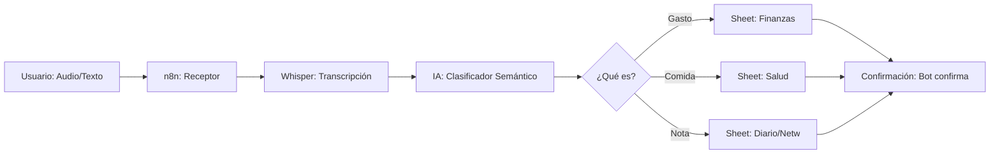

# 📦 UNIVERSAL FLOWS: The Life Log Engine (v3.3 MASTER)

Este documento define las funciones transversales de Cerebrin v3 que permiten capturar información del mundo real hacia estructuras digitales (Google Sheets / Excel) con cero fricción.

## 🏛️ FILOSOFÍA: "Input sin Fricción"
El éxito de Cerebrin radica en eliminar la necesidad de entrar a una app para registrar datos. El usuario usa **Llamadas de Voz o Mensajes Cortos** en WhatsApp/Telegram y la IA hace el trabajo sucio.

---

## 🚀 FLUJO TÉCNICO: DE AUDIO A PLANILLA

### El Clasificador de Inteligencia
La IA (OpenClaw Specialist) no solo transcribe, sino que **decide** el destino:
*   *"Me tomé un café de 2500"*: Tipo = Gasto, Monto = 2500, Categoría = Alimentación.
*   *"Almorcé un cuarto de pollo con ensalada"*: Tipo = Salud, Calorías ~ 600, Categoría = Almuerzo.

---

## 📊 ESQUEMA DE LA PLANILLA (Master Spreadsheet)

Para que el usuario pueda "verificar, cambiar o eliminar" sus datos fácilmente, n8n mantiene una estructura de columnas estandarizada en **Google Sheets**:

| Timestamp | Tipo de Registro | Categoría | Valor/Monto | Descripción | Texto Original |
| :--- | :--- | :--- | :--- | :--- | :--- |
| 22/02 18:30 | Gasto | Transporte | 15000 | Bencina auto | "Le puse 15 lucas de bencina" |
| 22/02 20:15 | Salud | Cena | 450 | Ensalada César | "Comí ensalada césar suave" |
| 22/02 21:00 | Networking | Contacto | - | Mario (React Expert) | "Conocí a Mario, experto en React" |

---

## 💡 FLUJOS GENERALES DISPONIBLES

### 1. Control de Gastos Personal/Pro
*   **Valor:** Registro inmediato de "caja chica" o gastos del día.
*   **Resumen:** Semanalmente, el agente envía: *"Esta semana gastaste $45.000 en transporte y $20.000 en café. Estás un 10% arriba de tu promedio"*.

### 2. Registro de Bienestar (Calorías/Salud)
*   **Valor:** No más apps de fitness complejas. Solo cuéntale al bot qué comiste.
*   **Inteligencia:** La IA hace la estimación calórica por ti basándose en el lenguaje natural.

### 3. Bitácora de Kilometraje & Combustible
*   **Valor:** Ideal para freelancers que rinden gastos de transporte o estudiantes que comparten gastos.
*   **Acción:** *"Llené estanque con 45.000 kms"*. La IA calcula autonomía y gasto por km.

### 4. Networking & CRM Personal
*   **Valor:** Registrar personas y acuerdos en el momento que suceden.
*   **Acción:** *"Anotar: Mario me debe el contacto del proveedor de APIs"*.

---

## 🔄 RESÚMENES PROACTIVOS (Push Delivery)
El sistema no es solo de escucha; n8n dispara resúmenes automáticos:
*   **Día:** Resumen de gastos del día (9 PM).
*   **Semana:** Reporte de salud y finanzas (Domingo AM).
*   **Mes:** Cierre de planilla listo para revisión antes de impuestos o metas.

---
*Versión: 3.3 | Estado: Flujos Universales | Integración con Google Sheets & n8n*
