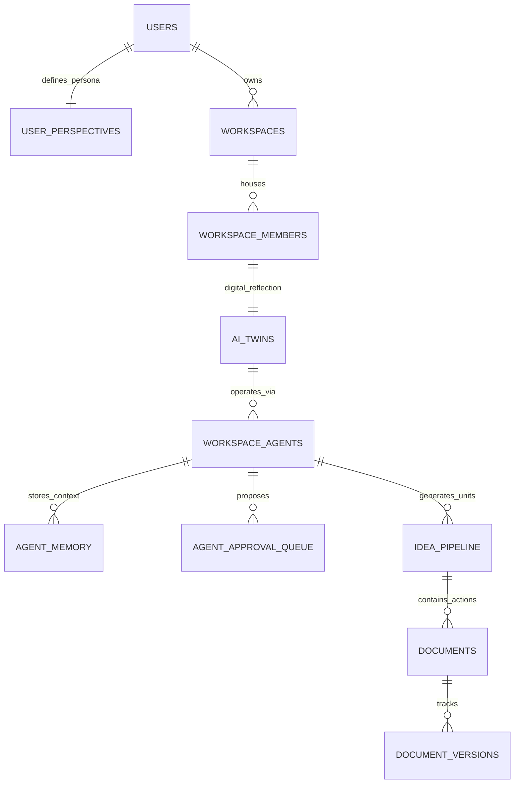

# 🗄️ DATABASE ARCHITECTURE: Schema & RLS Policies (v3.3 MASTER)

Este documento detalla la estructura del motor de Cerebrin (PostgreSQL en Supabase) y su evolución hacia el modelo de **AI Twins** para la personalización masiva.

## 🗺️ Diagrama de Relaciones (E-R)

---

## 🏛️ MAPPING JERARQUÍA V3 (5 Niveles)

| Nivel | Propósito | Tabla DB | Nota Técnica |
| :--- | :--- | :--- | :--- |
| **1. PERSONA** | Identidad y Tono | `user_perspectives` | Define los widgets de la UI y el System Prompt base del Twin. |
| **2. WORKSPACE** | El Contenedor | `workspaces` | Aislamiento total de datos vía RLS. |
| **3. UNITS** | Ramos / Proyectos | `idea_pipeline` | Columna `type` (course/project) y metadatos JSONB. |
| **4. ACTIONS** | Tareas / Certámenes | `documents` | Usamos `parent_id` para subtareas y `metadata` para notas/ponderación. |
| **5. KNOWLEDGE**| Documentos / Memoria | `agent_memory` | Solo guardamos **Embeddings (vectores)** y metadatos. El archivo es externo. |

---

## 🔐 ESTRATEGIA DE AI TWINS & AGENTES ESPECIALIZADOS

En la v3, el sistema no es una IA genérica, sino un ecosistema coordinado:
1.  **AI Twin (`ai_twins`):** Es el repositorio central del estilo y resonancia del usuario. No ejecuta tareas directamente, "supervisa".
2.  **Workspace Agents (`workspace_agents`):** Son los "sombreros" del Twin. Cada agente tiene un rol (Tutor, Vendedor, Planner) y acceso a **Skills** específicos definidos en `agent_configs`.
3.  **Segregación de Skill:** El Agente Tutor tiene el skill `drive_reader`, pero no el `email_sender`. Esto se controla mediante el JSON `permissions` en la configuración.

---

## 🚀 ESCALABILIDAD & SALUD TÉCNICA (Future-Proofing)

Para evitar que la base de datos se vuelva inmanejable con miles de usuarios, implementamos:

### 1. Soberanía de Datos (External Storage)
*   **No almacenamos Binarios:** Los archivos (PDFs, Imágenes) viven en el **Google Drive** o **Telegram** del usuario.
*   **DB solo guarda Referencias:** IDs de archivo, títulos y la URL de n8n para procesarlos.
*   **Embeddings Eficientes:** Usamos `pgvector` en Supabase para búsquedas semánticas rápidas sin necesidad de escaneo completo de tablas.

### 2. Bloat Control (Control de Crecimiento)
*   **JSONB para Metadatos:** En lugar de crear 50 columnas para campos de "Estudiantes" y otras 50 para "Ventas", usamos un solo campo `metadata` tipo JSONB. Esto mantiene las tablas delgadas y las consultas rápidas (`Gin Index`).
*   **Partitioning Predictivo:** Las tablas de logs (`activity_feed`) y estadísticas se particionan por mes. Los datos viejos se archivan automáticamente en "Cold Storage" tras 90 días.

### 3. TTL (Time to Live)
*   La tabla `agent_approval_queue` tiene un campo `expires_at`. Un worker de backend (o cron) elimina las propuestas no atendidas para mantener la cola limpia.

---

## 📊 Tipos de Datos Específicos V3
- **`category` (Agent Memory):** `profesional`, `estudios`, `clientes`, `agenda`, `proveedores`, `proyectos`, `ideas`.
- **`maturity_mode`:** `observer` (Escucha), `operator` (Propone), `executor` (Actúa).
- **`resonance_score`:** 0-100 (Unificador de confianza Usuario-IA).

---
*Versión: 3.3 | Última actualización: 22 Feb 2026 | Estado: Sincronizado con FRONTEND v3 y AI Twin Engine*
