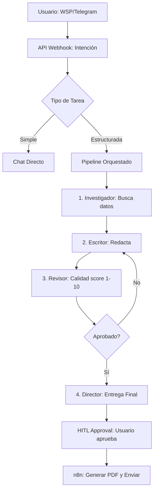

# 🔧 PIPELINE EXECUTION: Multi-Role Engine (v3.3 MASTER)

Este documento define cómo opera el motor de ejecución de Cerebrin utilizando agentes de OpenClaw.

## 🚀 Resumen del Motor
El sistema utiliza un orquestador que asume diferentes **roles/sombreros** para completar tareas complejas. Cerebrin actúa como el panel de gestión (UI) y OpenClaw como el motor de ejecución conectado a canales de mensajería.

---

## 🏛️ FLUJO DE PROCESAMIENTO



---

## 👥 ROLES DEFINIDOS (Sombreros)

| Rol | Skill Principal | Objetivo |
|:---|:---|:---|
| **🧠 Director** | Orquestación | Supervisa el flujo, entrega el resultado y pide aprobación. |
| **🔬 Investigador** | Búsqueda/RAG | Extrae datos de la web y de la Memoria del Agente. |
| **✍️ Escritor** | Storytelling | Transforma datos crudos en un documento profesional. |
| **🔎 Revisor** | Control de Calidad | Valida gramática, veracidad y cumplimiento del brief. |

---

## 📱 COMANDOS DE MENSAJERÍA (OpenClaw)

El usuario puede interactuar con el pipeline directamente desde WhatsApp o Telegram:

*   `estado`: Muestra en qué fase del pipeline está la tarea actual.
*   `tareas`: Lista las últimas 10 acciones registradas.
*   `aprobar`: Da el visto bueno a un entregable (HITL silencioso).
*   `ayuda`: Muestra los comandos disponibles según la **Persona** activa.

---

## 🔌 INTEGRACIÓN CON n8n (Delivery)

Una vez que el Director marca la tarea como finalizada y el usuario aprueba, se dispara el webhook de entrega:

```json
{
  "pipeline_id": "uuid",
  "project_id": "unit_id",
  "content": "Markdown final...",
  "format": ["pdf", "email"]
}
```

### Automatizaciones n8n:
1.  **Generate & Store:** Convierte el Markdown en PDF y lo guarda en Supabase Storage (Nivel 5: Knowledge).
2.  **Multichannel Delivery:** Envía el archivo por el mismo canal (WSP/TG) donde se originó el pedido.

---
*Versión: 3.3 | Última actualización: 22 Feb 2026 | Estado: Sincronizado con Estructura V3 y OpenClaw Gateway*
